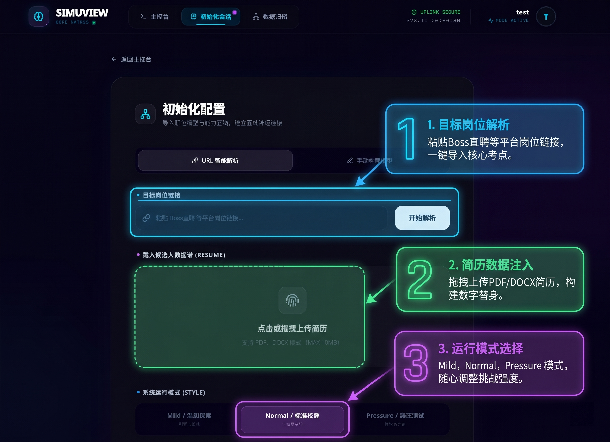
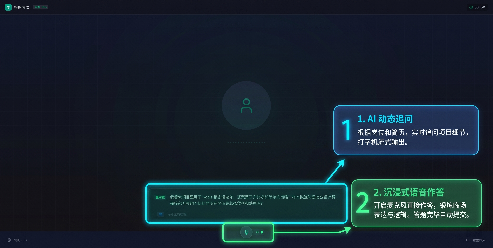
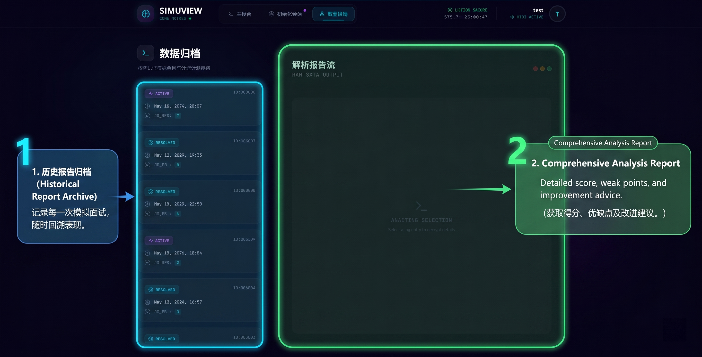

# 🚀 SimuView: 智能全真模拟面试与评估系统

<div align="center">
  
  <p align="center">
    <strong>基于大模型 (LLM) 的下一代沉浸式模拟面试解决方案</strong>
  </p>

  [](https://reactjs.org/)
  [](https://spring.io/projects/spring-boot)
  [](https://openai.com/)
  [](LICENSE)


---

## 🌟 项目简介

**SimuView** 是一款旨在消除面试焦虑、提升 Offer 命中率的智能全真模拟面试系统。它不仅能精准解析您的简历与岗位要求（JD），还能通过全双工语音交互（TTS/ASR）还原真实面试高压环境。面试结束后，系统将为您生成多维度的量化评估报告与能力图谱。

### 核心价值
- **消除焦虑**：在 1:1 还原的拟真环境中反复演练，变被动为主动。
- **深度复盘**：AI 导师为您捕捉表达细节，指出逻辑漏洞。
- **精准匹配**：基于真实 JD 生成问题，直击岗位核心考点。

---

## ✨ 核心特性

| 特性 | 描述 |
| :--- | :--- |
| **📄 智能解析** | 自动解析 PDF 简历与岗位链接/文本，提取关键技能矩阵。 |
| **🎙️ 沉浸式对答** | 集成 ASR (语音转文字) 与 TTS (文字转语音)，实现流畅的语音交互。 |
| **🎭 风格自定义** | 提供“温柔引导”、“常规面试”、“高压挑战”等多种 AI 面试风格。 |
| **📊 量化评估** | 生成多维度能力雷达图，包含逻辑、专业知识、表达等评分。 |
| **⌛ 历史追踪** | 完整保存每一次面试的录音、转写记录与评估报告。 |

---

## 📸 界面预览

<div align="center">
  <table border="0">
    <tr>
      <td><br/><p align="center">1. 数据导入与解析</p></td>
      <td><br/><p align="center">2. 沉浸式模拟对练</p></td>
      <td><br/><p align="center">3. 深度评估与复盘</p></td>
    </tr>
  </table>
</div>

---

## 🏗️ 系统架构

系统采用前后端分离架构，充分保障了高并发下的语音流稳定性：

- **Frontend**: React + TypeScript + Tailwind CSS (打造赛博朋克风格 UI)。
- **Backend**: Spring Boot + MyBatis-Plus (核心业务逻辑、AI 工作流调度)。
- **AI Stack**: 
  - **LLM**: 大模型驱动的面试逻辑与评估。
  - **TTS/ASR**: 基于高性能语音中枢的实时音轨处理。
- **Storage**: MySQL (结构化数据) + 阿里云 OSS (简历/音轨存档)。

---

## 🛠️ 环境要求

在启动项目之前，请确保您的本地开发环境已安装以下软件并符合版本要求：

| 软件 | 版本 | 说明 |
| :--- | :--- | :--- |
| **JDK** | 17+ | 后端运行核心环境 |
| **Maven** | 3.8+ | Java 项目构建工具 |
| **Node.js** | 20.x+ | 前端及语音服务运行环境 |
| **MySQL** | 8.0+ | 结构化数据存储 |
| **Redis** | 6.0+ | (可选) 用于缓存与会话管理 |

---

## ⚙️ 配置指南

### 1. 数据库准备
1. 创建数据库 `simuview`:
   ```sql
   CREATE DATABASE simuview CHARACTER SET utf8mb4 COLLATE utf8mb4_unicode_ci;
   ```
2. 运行项目根目录下的 `store.sql` 脚本初始化表结构。

### 2. 后端配置 (SimuViewBackEnd)
由于 `application.yml` 中使用了环境变量，您需要在 IDE (如 IntelliJ IDEA) 的 **Run/Debug Configurations** 中设置环境变量，或者创建一个 `src/main/resources/application-secret.yml` 文件。

**需要配置的参数：**

| 参数名 | 说明 |
| :--- | :--- |
| `SPRING_DATASOURCE_PASSWORD` | MySQL 数据库密码 |
| `SPRING_AI_OPENAI_API_KEY` | 大模型 API KEY (支持阿里云 DashScope 等兼容 OpenAI 接口的服务) |
| `ALIYUN_OSS_ACCESS_KEY_ID` | 阿里云 OSS AccessKey ID |
| `ALIYUN_OSS_ACCESS_KEY_SECRET` | 阿里云 OSS AccessKey Secret |
| `SIMUVIEW_JWT_SECRET_KEY` | JWT 签名密钥 (建议设置为 32 位以上随机字符串) |

### 3. 语音中枢配置 (TTSASRServer)
在 `TTSASRServer` 目录下，该服务负责处理 ASR (语音转文字) 与 TTS (文字转语音)。
1. 该服务通常需要配置相关语音引擎的 SDK 密钥。
2. 确保端口 `3000` (默认) 未被占用。

### 4. 前端环境变量 (SimuViewFrontEnd)
在 `SimuViewFrontEnd` 目录下创建 `.env` 文件：
```env
VITE_API_BASE_URL=http://localhost:8080
VITE_TTS_ASR_URL=http://localhost:3000
```

---

## 🚀 启动流程

### 1. 语音服务启动 (TTSASRServer)
该服务需最先启动，以供前端调用：
```bash
cd TTSASRServer
npm install
node server.js
```

### 2. 后端启动 (SimuViewBackEnd)
- 确认环境变量已正确加载。
```bash
cd SimuViewBackEnd
mvn clean install
mvn spring-boot:run
```

### 3. 前端启动 (SimuViewFrontEnd)
```bash
cd SimuViewFrontEnd
npm install
npm run dev
```

---


详细的设计文档与实践报告请参考项目根目录下的 `docx/` 文件夹：
- [《系统需求规格说明书》](./docx/基于大模型（LLM）的智能全真模拟面试与评估系统需求规格%20V1.0.docx)
- [《系统概要设计》](./docx/基于大模型（LLM）的智能全真模拟面试与评估系统概要设计%20V1.0.doc)
- [《系统架构图》](./images/系统架构图.png)

---

## 🤝 贡献与反馈

如果您在使用过程中发现任何 Bug 或有更好的功能建议，欢迎提交 **Issue** 或发起 **Pull Request**。

---

<div align="center">
  <p>Made with ❤️ by 符淏 (VoidXLab)</p>
</div>
