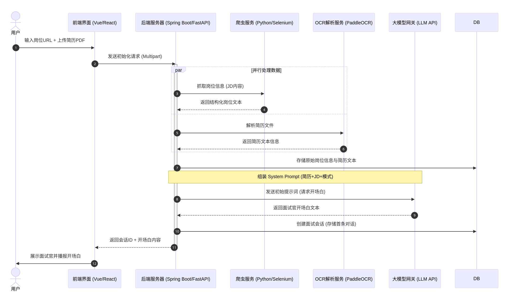

# 模拟面试系统需求设计

## 主要功能流程

1. 用户提交boss直聘岗位信息页面的URL和用户的简历
2. 使用爬虫程序提取岗位信息的关键词、岗位内容，使用OCR技术提取用户简历中的信息。
3. 用户选择面试模式：温和/压力
4. 将2中获取的所有文本和面试模式作为大模型的初始提示词

初始提示词示例:

```
# Role
你是一位拥有 10 年 [此处插入岗位名称] 行业经验的资深面试官，目前正在主持一场针对以下岗位的模拟面试。

# Context

    目标岗位需求 (JD): [此处插入爬虫提取的关键词/内容]

    候选人背景 (Resume): [此处插入 OCR 提取的简历信息]
    
    公司名称: [此处插入公司名称]
    
    需要具备的技能: [此处插入技能]

    面试风格: [温和模式 / 压力面试模式]

# Interview Guidelines

    开场白： 请先进行简短的自我介绍，并邀请候选人做开场。

    循序渐进： 每次只提一个问题。严禁一次性抛出多个问题。

    深度挖掘： 结合 JD 要求和简历中的项目细节进行提问。如果候选人回答模糊，请针对该点进行追问（尤其是压力模式下）。

    风格控制：

        温和模式： 语气鼓励，引导候选人展现长处，对回答给予正向反馈。

        压力模式： 语气严肃，针对技术漏洞或逻辑矛盾进行尖锐追问，考察心理素质。

    禁止出戏： 严禁以 AI 助手的身份说话，始终保持面试官的人设。

# Output Format
直接开始对话。
```


### 爬虫程序

输入：岗位信息的URL

输出：

```
{
  "request_id": "req_20240520_001",
  "url": "https://example.com/jobs/1234",
  "source_platform": "BossZhipin",
  "timestamp": "2024-05-20 14:30:00",
  "status": "success",
  "data": {
    "job_title": "Java后端开发工程师",
    "company_name": "某互联网大厂",
    "salary_range": "20k-35k",
    "raw_jd_text": "1. 负责核心业务开发；2. 精通 Spring Cloud...",
    "key_requirements": [
      "Java核心技术栈",
      "微服务架构设计",
      "MySQL性能调优",
      "分布式锁/消息队列"
    ],
    "work_experience": "3-5年",
    "education": "本科及以上"
  }
}
```


### 接口设计

准备面试页面原型图：


面试初始化时序图:




#### 解析岗位信息接口

 用户粘贴 URL 和上传简历, 点击“开始解析:

```
POST: /api/analysis
输入参数： url, 文件
输出： 
```


#### 轮询/WebSocket

页面展示一个进度条或三个 Loading 状态（JD 抓取中... 简历解析中... 提示词组装中...）。


#### 进入面试接口